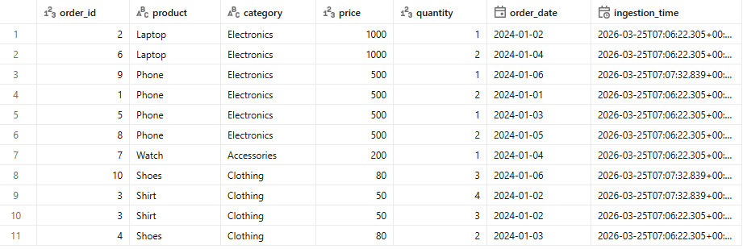
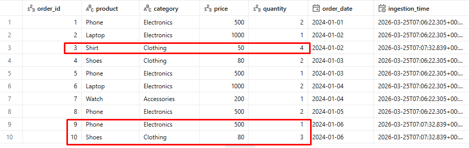
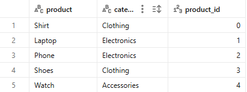
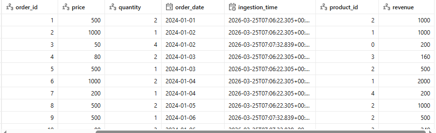

# End-to-End Data Engineering Pipeline (Databricks + Delta Lake)

## Overview

Production-style data pipeline using Databricks and Delta Lake, following the Medallion Architecture (Bronze → Silver → Gold).

---

## Technologies

- Databricks (PySpark)
- Delta Lake
- SQL / Window Functions
- Data Modeling (Fact & Dimension tables)

---

## Architecture

```
Raw  ──►  Bronze  ──►  Silver  ──►  Gold (Dim + Fact)
```

| Layer  | Description |
|--------|-------------|
| Raw    | Source data loaded into a Delta table as-is |
| Bronze | Raw data stamped with `ingestion_time`; partitioned by `order_date` |
| Silver | Cleaned, deduplicated, and upserted via MERGE on `order_id` |
| Gold   | `dim_product` (surrogate key) + `fact_sales` (revenue, FK join) |

---

## Incremental Processing

- **Watermark**: `ingestion_time` from Bronze is used to filter new records from Raw
- **Deduplication**: window function on `order_id`, ordered by `ingestion_time DESC`
- **Upsert**: Delta `MERGE` on `order_id` applied to Silver and `fact_sales`
- **Dim rebuild**: `dim_product` is always fully rebuilt (small table, ensures key consistency)

---

## Notebooks

| File | Purpose |
|------|---------|
| `00.config.py` | Shared config: catalog, table names, merge keys, partition column |
| `01.raw_to_bronze.py` | Raw → Bronze with watermark-based incremental filtering |
| `02.bronze_to_silver.py` | Bronze → Silver with cleaning, dedup, and MERGE |
| `03.silver_to_gold.py` | Silver → Gold: `dim_product` (hash surrogate key) + `fact_sales` |

---

## Getting Started

### 1. Cluster requirements

- Databricks Runtime: **13.x LTS** or higher (includes Delta Lake and PySpark)
- Node type: Single-node is fine for this dataset; scale up for larger volumes

### 2. Create the Unity Catalog schemas

Run these once in a Databricks SQL editor or notebook:

```sql
CREATE CATALOG IF NOT EXISTS wilson;

CREATE SCHEMA IF NOT EXISTS wilson.raw;
CREATE SCHEMA IF NOT EXISTS wilson.bronze;
CREATE SCHEMA IF NOT EXISTS wilson.silver;
CREATE SCHEMA IF NOT EXISTS wilson.gold;
```

### 3. Load source data into the Raw table

Upload `data/sales.csv` to a DBFS path, then run:

```python
df = spark.read.option("header", "true").option("inferSchema", "true") \
    .csv("/FileStore/tables/sales.csv")

df.write.format("delta").mode("overwrite").saveAsTable("wilson.raw.sales")
```

### 4. Run the pipeline — full load

Run notebooks in order, passing `load_type = full`:

```
01.raw_to_bronze    (load_type=full)
02.bronze_to_silver (load_type=full)
03.silver_to_gold   (load_type=full)
```

### 5. Run the pipeline — incremental load

Load `data/sales_incremental.csv` into `wilson.raw.sales` (append mode), then run:

```
01.raw_to_bronze    (load_type=incremental)
02.bronze_to_silver (load_type=incremental)
03.silver_to_gold   (load_type=incremental)
```

---

## load_type Reference

| Value | Behaviour |
|-------|-----------|
| `full` | Overwrites the target table from scratch |
| `incremental` | Appends/MERGEs only new or changed records |

---

## Data Quality Checks

Each notebook includes inline assertions that abort the run early on failure:

- Raw / Bronze must not be empty before proceeding
- Expected schema columns must be present
- Null counts reported for business columns before and after cleaning
- Row counts logged at each stage
- Post-write assertion confirms the target table is non-empty
- Gold fact warns if any `product_id` surrogate keys are NULL after the join

---

## Key Design Decisions

**Hash surrogate key instead of `monotonically_increasing_id()`**
`dim_product.product_id` is generated with `sha2(concat_ws("|", product, category), 256)`. This is deterministic — reruns, backfills, and parallel writes all produce the same key for the same product, so `fact_sales` foreign keys remain valid.

**Watermark from Bronze, not Silver**
The incremental filter in notebook 01 reads `max(ingestion_time)` from Bronze. Timestamps are comparable within the same layer. Reading from Silver (as in the original) mixed timestamps from different processing stages.

**Partition by `order_date`, not `order_id`**
Partitioning by `order_id` creates one file per row, which is catastrophic for performance. `order_date` has low cardinality and aligns with how downstream queries filter data.

---

## Screenshots

### Bronze


### Silver


### Gold — Dimension


### Gold — Fact


---

## Conclusion

This project demonstrates production data engineering patterns: incremental pipelines with watermark filtering, Delta MERGE upserts, medallion architecture, dimensional modeling with deterministic surrogate keys, and inline data quality checks at every stage.
